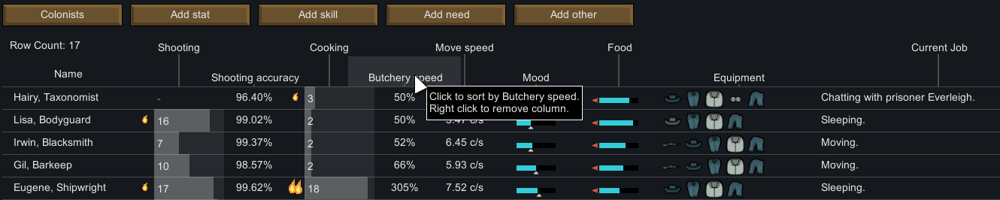

# Numbers!

Mod for RimWorld.

Ever wanted to compare multiple colonists? Quickly see who is on the verge of a mental break?
Now it's possible!

### Features

- Customizable overview tab, ~~up to 10 values at once~~ displays as many columns as you can fit on your screen
- Displays Stats, Skills, Needs
- Prisoner and medical controls, equipment overview, current job
- Works with colonists, prisoners, enemies, animals, wild animals, and even corpses

[RimWorld forum](https://ludeon.com/forums/index.php?topic=16558.0)

### Download

**Last update:** 22/12/2016 (updated to `0.6.0`)

[Latest release](https://github.com/koisama/kNumbers/releases/latest)

[All the releases](https://github.com/koisama/kNumbers/releases)

### Changelog

[Check changelog here](./CHANGELOG.md).

### Inspired by

Inspired by MedicalInfo by Fluffy (l2032)

### License

This mod can be used by anyone for any purpose as long as it's free and there's proper attribution - mod name, author's name and a link to this page.
